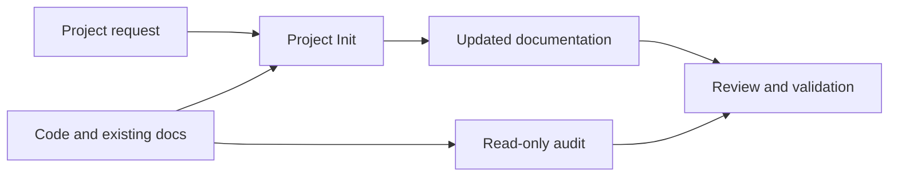

# Codex Project Init

[](LICENSE)  [](.codex-plugin/plugin.json) [](#english) [](#한국어)

Prepare and synchronize repository documentation with a Codex skill and a read-only auditor. / Codex 스킬과 읽기 전용 검사 도구로 저장소 문서를 정리하고 동기화합니다.

---

# English

## Overview

Turn working code into a project that contributors and Codex can understand.
One focused skill authors and maintains documentation; a separate Python auditor
provides read-only evidence about files and staged changes.
This README and [CHANGELOG.md](CHANGELOG.md) follow the repository's
[README](skills/project-init/references/readme.md) and
[CHANGELOG](skills/project-init/references/changelog.md) authoring guides.

## Features

- **Focused authoring** — Initialize missing guidance, synchronize affected docs,
  or update just the README, changelog, ADR, runbook, or reference requested.
- **Bilingual structure** — Use the [README template](skills/project-init/assets/readme.md)
  and [CHANGELOG template](skills/project-init/assets/changelog.md) for missing
  documents or requested format adoption; synchronize their paired sections.
- **Content preservation** — Retain custom content, existing languages, equivalent
  document layouts, and published history. Avoid unnecessary rewrites on repeat syncs.
- **Read-only evidence** — Inspect command provenance, local document links,
  scoped Git state, whitespace, and selected staged secret indicators; report
  skipped content and scan limits.

## Prerequisites

- Python 3.9+; the auditor and tests use the standard library.
- Git for Git observations, commit preflight, and the test suite.
- Codex with plugin support and its bundled plugin-creator helpers for plugin
  installation.
- Make for the development and packaging commands below.

## Installation

Run from the root of a source checkout:

```bash
# Preview the installation plan.
python3 scripts/install.py --dry-run
# Install after reviewing the plan.
python3 scripts/install.py
```

The plugin is copied to `~/plugins/codex-project-init` and added to the personal
marketplace at `~/.agents/plugins/marketplace.json`, preserving its other entries.
Keep the checkout separate from the installation destination. Open a new Codex
thread afterward.

For an update, preview the replacement, then install it with a backup of the
previous source:

```bash
# Preview a replacement.
python3 scripts/install.py --dry-run --replace
# Replace the installed source and retain its backup.
python3 scripts/install.py --replace
```

If multiple Codex installations exist, pass `--codex /absolute/path/to/codex`
to both the dry run and installation so they use the same executable.

Alternatively, unpack the standalone skill ZIP produced by `make package` and
place the whole `project-init` folder in `~/.agents/skills/` or the project's
`.agents/skills/` directory. Keep its references, assets, and
`scripts/project_init_audit/` package together. Choose one installation method
to avoid duplicate entries. See the [release/install runbook](docs/runbooks/release.md)
for packaging and recovery details.

## Usage

In a Codex conversation, select Project Init or send one of these requests:

```text
$project-init init .
$project-init readme .
$project-init changelog unreleased
$project-init sync .
$project-init check .
$project-init prepare-commit .
$project-init add-adr document-storage-choice
$project-init add-runbook release
$project-init add-reference-doc terminal
```

The full plugin skill name is `codex-project-init:project-init`. Recognized
operation aliases include `init-project`, `generate-readme`, `generate-changelog`,
`sync-doc`, `sync-docs`, and `health-check`.

Run the auditor directly from the checkout:

```bash
python3 skills/project-init/scripts/project_audit.py inspect /path/to/project
python3 skills/project-init/scripts/project_audit.py check /path/to/project
python3 skills/project-init/scripts/project_audit.py check /path/to/project --for-commit
```

For a targeted request or custom documentation layout:

```bash
python3 skills/project-init/scripts/project_audit.py check /path/to/project \
  --profile existing --require-document README.md
```

To display the JSON schema version and inspection status for this checkout:

```bash
python3 skills/project-init/scripts/project_audit.py inspect . | \
  python3 -c 'import json, sys; report = json.load(sys.stdin); print(report["schema_version"], report["status"])'
```

Output:

```text
1 observed
```

Document preparation does not itself request commits, pushes, remote creation,
deployments, or hook installation. Existing user authorization still applies.
Claude-specific integrations require a [compatibility assessment](skills/project-init/references/migration.md).

## Configuration

Configure the auditor with CLI options. The installer and optional integration
trials read these environment variables:

| Variable | Description | Default |
|---|---|---|
| `CODEX_HOME` | Codex state directory; also locates bundled plugin-creator helpers. | `$HOME/.codex` |
| `PROJECT_INIT_REAL_INTEGRATION` | Set to `1` to enable optional installed-tool trials. | `unset` |
| `PROJECT_INIT_REAL_CODEX` | Codex executable for optional integration trials. | `codex` |
| `PROJECT_INIT_REAL_HELPERS` | Plugin-creator scripts directory for optional integration trials. | `$CODEX_HOME/skills/.system/plugin-creator/scripts` |

The helper-directory default uses the effective `CODEX_HOME` fallback above.
The installer uses `HOME` for its source destination and personal marketplace,
and finds Codex through `PATH` unless `--codex` selects an executable.

## Project Structure

Selected paths:

```text
codex-project-init/
├── .codex-plugin/plugin.json          # Plugin metadata and version
├── AGENTS.md                          # Repository instructions
├── README.md
├── CHANGELOG.md
├── CONTRIBUTING.md
├── LICENSE
├── NOTICE
├── Makefile
├── docs/                              # Architecture, onboarding, and operating docs
├── scripts/
│   ├── distribution.py                # Shared installation and packaging payload
│   ├── install.py                     # Personal-marketplace installer
│   ├── package_plugin.py              # Reproducible ZIP builder
│   └── validate_distribution.py       # Source and archive validation
├── skills/project-init/
│   ├── SKILL.md                       # Operation routing
│   ├── agents/openai.yaml             # Skill metadata
│   ├── references/                    # README, changelog, and workflow guides
│   ├── assets/                        # Document templates
│   └── scripts/
│       ├── project_audit.py           # CLI entrypoint
│       └── project_init_audit/        # Auditor implementation
└── tests/                             # Helper tests and isolated skill trials
```



Read [architecture](docs/architecture.md), [onboarding](docs/onboarding.md),
and the [docs index](docs/README.md) for component details and development setup.

## Testing

Run checks from the repository root. No CI workflow is configured.

```bash
# Run the complete helper suite and source/document checks.
make test
make check
# Run one test file.
python3 -m unittest discover -s tests -p 'test_project_audit.py' -v
```

Auditor tests use real temporary Git repositories and filesystem boundaries.
Installation tests use temporary homes and controlled CLI behavior; packaging
tests extract both artifacts and check their content.

With Codex and its plugin-creator helpers installed, enable optional integration
trials:

```bash
PROJECT_INIT_REAL_INTEGRATION=1 make test
```

These trials use scratch profiles and CLI help without installing a live plugin
or using credentials. Select local tools with the `PROJECT_INIT_REAL_CODEX`
and `PROJECT_INIT_REAL_HELPERS` variables above. For skill workflow changes,
also run the [isolated behavior trials](docs/reference/skill-evaluation.md) and
review actual output, preservation, and repeated-run behavior.

Build and validate distributions after the final source or documentation edit:

```bash
make package
python3 scripts/validate_distribution.py
```

Packaging validates the selected payload and writes reproducible plugin/skill
ZIPs to `dist/`, with checksums in `dist/manifest.json`. Reproducibility requires
matching inputs and Python/compression tooling. The version source is
`.codex-plugin/plugin.json`. Do not edit generated ZIPs directly; follow the
[release/install runbook](docs/runbooks/release.md).

## API Documentation

Read the [auditor CLI and JSON contract](docs/reference/auditor.md). Reports go
to stdout; invocation errors go to stderr. `inspect` exits 0; `check` exits 1 for
errors and 0 for warnings/pass. Invalid arguments or a nonexistent target return 2.

The default `core` profile checks core document roles and common equivalent
paths. `existing` checks the documents already present; repeat
`--require-document` to require specific target-relative paths.
`--for-commit` requires valid Git metadata and reads staged blobs from the index.
Git checks stay within the requested subproject; documentation links describe
the working tree.

Read `scan.complete`, `scan.skipped`, `scan.limits`, and findings as well as the
exit code: a zero exit code can accompany an incomplete scan.
`project.command_evidence` distinguishes declared commands from conventional
suggestions. The auditor reports unreadable, external, cyclic, special, and
oversized content; it does not follow file links outside the target.

The auditor never executes project scripts, including Git clean/process filters.
The skill's `check` mode also leaves project tests unexecuted. Authoring and
commit preparation run relevant checks within the user's requested scope.
Structural checks do not replace semantic review or application tests; staged
secret indicators are limited. Heading anchors and external websites require
separate review.

## Contributing

Read [CONTRIBUTING.md](CONTRIBUTING.md) and [AGENTS.md](AGENTS.md), and follow the
established branch and remote workflow:

1. Fork the [repository](https://github.com/whchoi98/codex-project-init) and clone
   your fork.
2. Create a branch, for example `git switch -c docs/refresh-project-guides`.
3. Preserve custom content and release history, update both public language
   sections and `CHANGELOG.md`, and run `make test`, `make check`, and
   `make package`. Stage only intended paths, review the exact staged diff, and commit
   with a descriptive message such as
   `git commit -m "docs: refresh bilingual project guides"`.
4. Confirm `origin` points to your fork, then push the branch with
   `git push -u origin docs/refresh-project-guides`.
5. Open a [pull request](https://github.com/whchoi98/codex-project-init/pulls)
   against the upstream default branch and describe the changes and actual checks.

## License

Licensed under the [MIT license](LICENSE). This Codex implementation adapts the
original [whchoi98/project-init](https://github.com/whchoi98/project-init)
workflow, maintained source version 2.4.0. See [NOTICE](NOTICE) for attribution;
the original MIT notice is preserved in `LICENSE`.

## Contact

Maintainer: [whchoi98](https://github.com/whchoi98).
Use [GitHub Issues](https://github.com/whchoi98/codex-project-init/issues) for
questions and bug reports. No public contact email is published in this repository.

---

<a id="korean"></a>
# 한국어

## 개요

구현된 코드를 기여자와 Codex가 이해할 수 있는 프로젝트로 정리합니다. 하나의
스킬이 문서를 작성하고 유지하며, 별도의 Python 검사 도구가 파일과 스테이징된
변경에 대한 읽기 전용 근거를 제공합니다.
이 README와 [CHANGELOG.md](CHANGELOG.md)는 저장소의
[README](skills/project-init/references/readme.md) 및
[CHANGELOG](skills/project-init/references/changelog.md) 작성 지침을 따릅니다.

## 주요 기능

- **요청에 맞춘 작성** — 부족한 문서를 초기화하고, 변경에 영향받는 문서를
  동기화하거나, 요청한 README·변경 이력·ADR·런북·참조 문서만 갱신합니다.
- **이중 언어 구조** — 새 문서나 요청받은 형식 전환에
  [README 템플릿](skills/project-init/assets/readme.md)과
  [CHANGELOG 템플릿](skills/project-init/assets/changelog.md)을 사용하고,
  대응하는 양언어 섹션을 함께 동기화합니다.
- **기존 내용 보존** — 사용자 작성 내용, 기존 언어, 같은 역할을 하는 문서
  구조와 공개된 이력을 보존합니다. 동기화를 반복해도 불필요하게 다시 쓰지 않습니다.
- **읽기 전용 근거** — 명령 출처, 로컬 문서 링크, 지정 범위의 Git 상태,
  공백 오류와 일부 스테이징 시크릿 징후를 확인하고 건너뛴 내용과 검사 한도를
  보고합니다.

## 사전 요구 사항

- Python 3.9 이상이 필요하며 검사 도구와 테스트는 표준 라이브러리를 사용합니다.
- Git 조사, 커밋 사전 검사, 테스트에는 Git이 필요합니다.
- 플러그인 설치에는 플러그인을 지원하는 Codex와 번들 plugin-creator
  도우미가 필요합니다.
- 아래 개발·패키징 명령에는 Make가 필요합니다.

## 설치 방법

소스 사본의 저장소 루트에서 실행합니다.

```bash
# 설치 계획을 미리 확인합니다.
python3 scripts/install.py --dry-run
# 계획을 검토한 뒤 설치합니다.
python3 scripts/install.py
```

플러그인을 `~/plugins/codex-project-init`에 복사하고 개인 마켓플레이스
`~/.agents/plugins/marketplace.json`에 등록하며, 다른 항목은
보존합니다. 소스 사본과 설치 대상은 서로 다른 경로에 둡니다.
설치 후 새 Codex 대화를 여세요.

갱신할 때는 교체 계획을 미리 확인한 뒤 이전 소스를 백업하며 설치합니다.

```bash
# 교체 계획을 미리 확인합니다.
python3 scripts/install.py --dry-run --replace
# 설치된 소스를 교체하고 백업을 남깁니다.
python3 scripts/install.py --replace
```

Codex가 여러 경로에 설치되어 있다면 dry run과 설치에
`--codex /absolute/path/to/codex`를 지정해 같은 실행 파일을 사용합니다.

`make package`로 만든 단독 스킬 ZIP을 풀어 `project-init` 폴더 전체를
`~/.agents/skills/` 또는 프로젝트의 `.agents/skills/`에 넣을 수도 있습니다.
참조 문서, 템플릿, `scripts/project_init_audit/` 패키지를 함께 유지합니다.
중복 등록을 피하려면 한 가지 설치 방법을 선택합니다. 패키징과 복구에 관한
내용은 [릴리스·설치 런북](docs/runbooks/release.md)을 참고하세요.

## 사용법

Codex 대화에서 Project Init 스킬을 선택하거나 다음과 같이 요청합니다.

```text
$project-init init .
$project-init readme .
$project-init changelog unreleased
$project-init sync .
$project-init check .
$project-init prepare-commit .
$project-init add-adr document-storage-choice
$project-init add-runbook release
$project-init add-reference-doc terminal
```

플러그인의 전체 스킬 이름은 `codex-project-init:project-init`입니다.
`init-project`, `generate-readme`, `generate-changelog`, `sync-doc`, `sync-docs`,
`health-check` 이름도 작업 별칭으로 처리합니다.

소스 사본에서 검사 도구를 직접 실행합니다.

```bash
python3 skills/project-init/scripts/project_audit.py inspect /path/to/project
python3 skills/project-init/scripts/project_audit.py check /path/to/project
python3 skills/project-init/scripts/project_audit.py check /path/to/project --for-commit
```

일부 문서만 요청했거나 별도의 문서 구조를 사용하는 경우:

```bash
python3 skills/project-init/scripts/project_audit.py check /path/to/project \
  --profile existing --require-document README.md
```

현재 소스 사본의 JSON 스키마 버전과 조사 상태를 출력합니다.

```bash
python3 skills/project-init/scripts/project_audit.py inspect . | \
  python3 -c 'import json, sys; report = json.load(sys.stdin); print(report["schema_version"], report["status"])'
```

출력:

```text
1 observed
```

문서 준비만으로 커밋·푸시·원격 생성·배포·훅 설치를 요청한 것으로
간주하지 않습니다. 기존 사용자 허용 범위는 계속 적용합니다.
Claude 전용 연동은 [호환성 검토](skills/project-init/references/migration.md)가 필요합니다.

## 환경 설정

검사 도구는 CLI 옵션으로 설정합니다. 설치 도구와 선택적 통합 검증은 다음
환경 변수를 읽습니다.

| 변수명 | 설명 | 기본값 |
|---|---|---|
| `CODEX_HOME` | Codex 상태 디렉터리이며 번들 plugin-creator 도우미의 위치 기준입니다. | `$HOME/.codex` |
| `PROJECT_INIT_REAL_INTEGRATION` | `1`로 지정하면 설치된 도구를 사용하는 선택적 검증을 활성화합니다. | `unset` |
| `PROJECT_INIT_REAL_CODEX` | 선택적 통합 검증에서 사용할 Codex 실행 파일입니다. | `codex` |
| `PROJECT_INIT_REAL_HELPERS` | 선택적 통합 검증에서 사용할 plugin-creator 스크립트 디렉터리입니다. | `$CODEX_HOME/skills/.system/plugin-creator/scripts` |

도우미 디렉터리의 기본값에는 위의 기본 경로를 반영한 `CODEX_HOME`을 사용합니다.
설치 도구는 `HOME`을 기준으로 소스 설치 대상과 개인 마켓플레이스를 정하고,
`--codex`로 실행 파일을 지정하지 않으면 `PATH`에서 Codex를 찾습니다.

## 프로젝트 구조

주요 경로:

```text
codex-project-init/
├── .codex-plugin/plugin.json          # 플러그인 메타데이터와 버전
├── AGENTS.md                          # 저장소 지침
├── README.md
├── CHANGELOG.md
├── CONTRIBUTING.md
├── LICENSE
├── NOTICE
├── Makefile
├── docs/                              # 아키텍처, 온보딩, 운영 문서
├── scripts/
│   ├── distribution.py                # 설치와 패키징의 공통 배포 대상
│   ├── install.py                     # 개인 마켓플레이스 설치 도구
│   ├── package_plugin.py              # 재현 가능한 ZIP 생성 도구
│   └── validate_distribution.py       # 소스와 배포 파일 검증
├── skills/project-init/
│   ├── SKILL.md                       # 작업 분기
│   ├── agents/openai.yaml             # 스킬 메타데이터
│   ├── references/                    # README, 변경 이력, 작업 흐름 지침
│   ├── assets/                        # 문서 템플릿
│   └── scripts/
│       ├── project_audit.py           # CLI 진입점
│       └── project_init_audit/        # 검사 도구 구현
└── tests/                             # 도우미 테스트와 격리된 스킬 시나리오
```


[아키텍처](docs/architecture.md), [온보딩](docs/onboarding.md),
[문서 목차](docs/README.md)에서 구성 요소와 개발 환경 준비 방법을 확인합니다.

## 테스트

저장소 루트에서 검증을 실행합니다. CI 워크플로는 구성되어 있지 않습니다.

```bash
# 전체 도우미 테스트와 소스·문서 검사를 실행합니다.
make test
make check
# 테스트 파일 하나를 실행합니다.
python3 -m unittest discover -s tests -p 'test_project_audit.py' -v
```

검사 도구 테스트는 실제 임시 Git 저장소와 파일 접근 경계를 확인합니다. 설치
테스트는 임시 사용자 디렉터리와 통제된 CLI 동작을 사용하며, 패키징 테스트는
두 배포 파일을 압축 해제해 내용을 확인합니다.

Codex와 plugin-creator 도우미가 설치되어 있다면 선택적 통합 검증을 활성화합니다.

```bash
PROJECT_INIT_REAL_INTEGRATION=1 make test
```

임시 프로필과 CLI 도움말을 사용하며 실제 플러그인을 설치하거나 자격 증명을
사용하지 않습니다. 위의 `PROJECT_INIT_REAL_CODEX`와 `PROJECT_INIT_REAL_HELPERS`
변수로 로컬 도구를 선택합니다. 스킬 작업 흐름을 변경하면
[격리된 동작 시나리오](docs/reference/skill-evaluation.md)도 실행하고 실제 결과,
기존 내용 보존, 반복 실행 동작을 검토합니다.

마지막 소스·문서 편집 후 배포 파일을 다시 빌드하고 검증합니다.

```bash
make package
python3 scripts/validate_distribution.py
```

패키징은 배포 대상을 검증한 뒤 `dist/`에 재현 가능한 플러그인·스킬 ZIP을,
`dist/manifest.json`에 체크섬 목록을 만듭니다. 재현성을 위해서는 입력과
Python·압축 도구가 같아야 합니다. 버전 기준은 `.codex-plugin/plugin.json`입니다.
생성된 ZIP은 직접 수정하지 않고 [릴리스·설치 런북](docs/runbooks/release.md)을
따릅니다.

## API 문서

[검사 도구 CLI·JSON 계약](docs/reference/auditor.md)을 참고하세요. 결과는 stdout,
잘못된 호출에 대한 오류는 stderr로 출력합니다. `inspect`는 0을 반환하며,
`check`는 오류가 있으면 1, 경고만 있거나 통과하면 0을 반환합니다.
잘못된 인수나 존재하지 않는 대상은 2를 반환합니다.

기본 `core` 프로필은 핵심 문서의 역할과 일반적인 대체 경로를 확인합니다.
`existing`은 이미 있는 문서를 검사합니다. 대상 기준 상대 경로를 지정하는
`--require-document`를 반복하면 특정 문서를 필수로 요구할 수 있습니다.
`--for-commit`은 유효한 Git 메타데이터를 요구하고 인덱스의 스테이징된 내용을
읽습니다. Git 검사는 요청한 하위 프로젝트 범위를 유지하며 문서 링크는
작업 트리를 기준으로 확인합니다.

종료 코드와 함께 `scan.complete`, `scan.skipped`, `scan.limits` 및 발견 사항을
확인하세요. 종료 코드가 0이어도 검사가 불완전할 수 있습니다.
`project.command_evidence`는 선언된 명령과 관례적 제안을 구분합니다.
검사 도구는 읽기 실패, 외부·순환 링크, 특수 파일, 큰 파일을 보고하며
대상 밖으로 연결되는 파일 링크를 따라가지 않습니다.

검사 도구는 Git clean/process 필터를 포함해 프로젝트 명령을 실행하지 않습니다.
스킬의 `check` 모드에서도 프로젝트 테스트를 실행하지 않습니다. 문서 작성과
커밋 준비에서는 요청 범위에 맞는 검증을 실행합니다. 구조 검사는 문서 내용
검토나 애플리케이션 테스트를 대신하지 않으며 스테이징 시크릿 징후 검사도
범위가 제한적입니다. 제목 앵커와 외부 웹사이트는 별도로 검토해야 합니다.

## 기여 방법

[CONTRIBUTING.md](CONTRIBUTING.md)와 [AGENTS.md](AGENTS.md)를 읽고
기존 브랜치·원격 저장소 작업 방식을 따릅니다.

1. [저장소](https://github.com/whchoi98/codex-project-init)를 포크하고
   자신의 포크를 복제합니다.
2. `git switch -c docs/refresh-project-guides`와 같이 작업 브랜치를 만듭니다.
3. 사용자 작성 내용과 릴리스 이력을 보존하고 양언어 공개 문서와 `CHANGELOG.md`를
   갱신한 뒤 `make test`, `make check`, `make package`를 실행합니다.
   의도한 경로만 스테이징하고 실제 스테이징된 차이를 검토한 뒤
   `git commit -m "docs: refresh bilingual project guides"`처럼
   변경을 설명하는 메시지로 커밋합니다.
4. `origin`이 자신의 포크를 가리키는지 확인한 뒤
   `git push -u origin docs/refresh-project-guides`로 브랜치를 푸시합니다.
5. 원본 저장소의 기본 브랜치를 대상으로
   [풀 리퀘스트](https://github.com/whchoi98/codex-project-init/pulls)를 열고
   변경 내용과 실제 검증 결과를 설명합니다.

## 라이선스

[MIT 라이선스](LICENSE)를 따릅니다. 이 Codex 구현은 원본
[whchoi98/project-init](https://github.com/whchoi98/project-init)의
유지보수 소스 버전 2.4.0 작업 흐름을 바탕으로 합니다.
출처는 [NOTICE](NOTICE)에 기록하며 원본 MIT 고지는 `LICENSE`에 보존합니다.

## 연락처

유지관리자: [whchoi98](https://github.com/whchoi98).
질문과 버그 보고는 [GitHub Issues](https://github.com/whchoi98/codex-project-init/issues)를
이용하세요. 이 저장소에는 공개 연락처 이메일이 기재되어 있지 않습니다.
