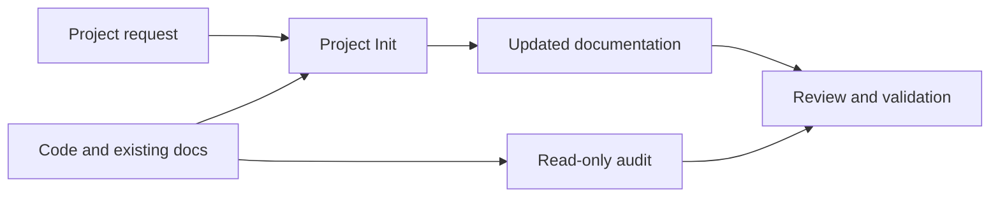

# Codex Project Init

Version: **0.1.0** · [Changelog](CHANGELOG.md) · [MIT license](LICENSE)

<a href="#english">English</a> · <a href="#korean">한국어</a>

<a id="english"></a>
## English

### Overview

Turn working code into a project that contributors and Codex can understand.
One focused skill authors and maintains documentation; a separate Python auditor
provides read-only evidence about files and staged changes.

- Initialize missing guidance, synchronize affected docs, or update just the
  README, changelog, ADR, runbook, or reference the user requests.
- Preserve custom content, existing languages, equivalent document layouts, and
  published history. Repeated syncs avoid unnecessary rewrites.
- Inspect command provenance, local document links, scoped Git state, whitespace,
  and selected staged secret indicators. Report skipped content and scan limits.

### Install

Use Python 3.9+, Git for Git checks, and Codex with plugin support. The auditor
uses the standard library. Installation uses Codex's bundled plugin-creator helpers.

```bash
python3 scripts/install.py --dry-run
python3 scripts/install.py
```

The plugin is copied to `~/plugins/codex-project-init` and added to the personal
marketplace, preserving its other entries. Open a new Codex thread afterward.
For an update, preview `--dry-run --replace`, then use `--replace`; the previous
source is backed up.
If multiple Codex installations exist, pass `--codex /absolute/path/to/codex`
to both the dry run and installation so they use the same executable.

Alternatively, unpack the standalone skill ZIP and place the whole `project-init`
folder in a user or project `.agents/skills/` directory. Choose one installation
method to avoid duplicate entries.

### Use

Select Project Init in Codex, or request:

```text
$project-init init .
$project-init readme .
$project-init changelog unreleased
$project-init sync .
$project-init check .
$project-init prepare-commit .
$project-init add-adr document-storage-choice
$project-init add-runbook release
$project-init add-reference-doc terminal
```

The full plugin skill name is `codex-project-init:project-init`. The original
`init-project`, `generate-readme`, `generate-changelog`, `sync-docs`, and
`health-check` names are also recognized as operation aliases.

```bash
python3 skills/project-init/scripts/project_audit.py inspect /path/to/project
python3 skills/project-init/scripts/project_audit.py check /path/to/project
python3 skills/project-init/scripts/project_audit.py check /path/to/project --for-commit
```

For a targeted request or custom documentation layout:

```bash
python3 skills/project-init/scripts/project_audit.py check /path/to/project \
  --profile existing --require-document README.md
```

The default `core` profile checks core document roles and common equivalent
paths. `existing` checks the documents already present; repeat
`--require-document` to require specific target-relative paths.

`check` exits 1 for errors, 0 for warnings/pass, and 2 for invalid invocation.
Read `scan.complete` and findings as well as the exit code. `--for-commit`
requires valid Git metadata and reads staged blobs from the index; Git checks
stay within the requested subproject. Documentation links describe the working
tree. Structural checks do not replace semantic review or application tests.

The auditor never executes project scripts, including Git clean/process filters.
The skill's `check` mode also leaves project tests unexecuted. Authoring and
commit preparation run relevant checks within the user's requested scope.
See the [auditor contract](docs/reference/auditor.md) for coverage and limitations.

### Workflow and development



Read [architecture](docs/architecture.md), [onboarding](docs/onboarding.md),
the [docs index](docs/README.md), and [contribution guidance](CONTRIBUTING.md).

```bash
make test
make check
make package
```

Packaging validates the selected payload and writes reproducible plugin/skill
ZIPs and a checksum manifest to `dist/`. The version source is
`.codex-plugin/plugin.json`. Document preparation does not itself request
commits, pushes, remotes, deployments, or hook installation. Claude-specific
integrations require a compatibility assessment. The original Claude project-init
workflow is credited in [NOTICE](NOTICE).

<a id="korean"></a>
## 한국어

### 개요

구현된 코드를 기여자와 Codex가 이해할 수 있는 프로젝트로 정리합니다. 하나의
스킬이 문서를 작성하고 유지하며, 별도의 Python 검사 도구가 파일과 스테이징된
변경에 대한 읽기 전용 근거를 제공합니다.

- 부족한 문서를 초기화하고, 변경에 영향받는 문서를 동기화하거나, 요청한
  README·변경 이력·ADR·런북·참조 문서만 갱신합니다.
- 사용자 작성 내용, 기존 언어, 같은 역할을 하는 문서 구조, 공개된 이력을
  보존합니다. 동기화를 반복해도 불필요하게 다시 쓰지 않습니다.
- 명령의 출처, 로컬 문서 링크, 지정 범위의 Git 상태, 공백 오류, 일부 스테이징
  시크릿 징후를 확인합니다. 건너뛴 내용과 검사 한도를 결과에 표시합니다.

### 설치

Python 3.9 이상과 플러그인을 지원하는 Codex를 준비합니다. Git 검사에는 Git이
필요합니다. 검사 도구는 표준 라이브러리만 사용하며, 설치 과정에서는 Codex에
포함된 plugin-creator 도우미를 사용합니다.

```bash
python3 scripts/install.py --dry-run
python3 scripts/install.py
```

플러그인을 `~/plugins/codex-project-init`에 복사하고 개인 마켓플레이스에
등록하며, 다른 등록 항목은 보존합니다. 설치 후 새 Codex 대화를 여세요.
갱신 시에는 `--dry-run --replace`로 확인한 뒤 `--replace`를 사용합니다.
이전 소스는 백업합니다.
Codex가 여러 경로에 설치되어 있다면 dry run과 설치에
`--codex /absolute/path/to/codex`를 지정해 같은 실행 파일을 사용합니다.

단독 스킬 ZIP의 `project-init` 폴더 전체를 사용자 또는 프로젝트
`.agents/skills/`에 넣을 수도 있습니다. 중복 등록을 피하려면 한 가지 설치
방법을 선택합니다.

### 사용

Codex에서 Project Init 스킬을 선택하거나 다음과 같이 요청합니다.

```text
$project-init init .
$project-init readme .
$project-init changelog unreleased
$project-init sync .
$project-init check .
$project-init prepare-commit .
$project-init add-adr document-storage-choice
$project-init add-runbook release
$project-init add-reference-doc terminal
```

플러그인의 전체 스킬 이름은 `codex-project-init:project-init`입니다. 기존
`init-project`, `generate-readme`, `generate-changelog`, `sync-docs`,
`health-check` 이름도 작업 별칭으로 처리합니다.

```bash
python3 skills/project-init/scripts/project_audit.py inspect /path/to/project
python3 skills/project-init/scripts/project_audit.py check /path/to/project
python3 skills/project-init/scripts/project_audit.py check /path/to/project --for-commit
```

일부 문서만 요청했거나 별도의 문서 구조를 사용하는 경우:

```bash
python3 skills/project-init/scripts/project_audit.py check /path/to/project \
  --profile existing --require-document README.md
```

기본 `core` 프로필은 핵심 문서의 역할과 일반적인 대체 경로를 확인합니다.
`existing`은 이미 있는 문서를 검사합니다. 대상 기준 상대 경로를 지정하는
`--require-document`를 반복하면 특정 문서를 필수로 요구할 수 있습니다.

`check`는 오류 시 1, 경고만 있거나 통과하면 0, 잘못된 호출이면 2를 반환합니다.
종료 코드와 함께 `scan.complete` 및 발견 사항을 확인하세요. `--for-commit`은
유효한 Git 메타데이터를 요구하고 인덱스의 스테이징된 내용을 읽습니다. Git
검사는 요청한 하위 프로젝트 범위를 유지하며 문서 링크는 작업 트리를 기준으로
확인합니다. 구조 검사는 문서 내용 검토나 애플리케이션 테스트를 대신하지 않습니다.

검사 도구는 Git clean/process 필터를 포함해 프로젝트 명령을 실행하지 않습니다.
스킬의 `check` 모드에서도 프로젝트 테스트를 실행하지 않습니다. 문서 작성과
커밋 준비에서는 요청 범위에 맞는 검증을 실행합니다.
검사 범위와 한계는 [검사 도구 계약](docs/reference/auditor.md)을 참고하세요.

### 작업 흐름과 개발


[아키텍처](docs/architecture.md), [온보딩](docs/onboarding.md),
[문서 목차](docs/README.md), [기여 지침](CONTRIBUTING.md)을 참고하세요.

```bash
make test
make check
make package
```

패키징은 배포 대상을 검증한 뒤 `dist/`에 재현 가능한 플러그인·스킬 ZIP과
체크섬 목록을 만듭니다. 버전 기준은 `.codex-plugin/plugin.json`입니다.
문서 준비만으로 커밋·푸시·원격 생성·배포·훅
설치를 요청한 것으로 간주하지 않습니다. Claude 전용 연동은 별도로 호환성을
확인합니다. 원본 Claude project-init 작업 흐름의 출처는 [NOTICE](NOTICE)에
기록합니다.
