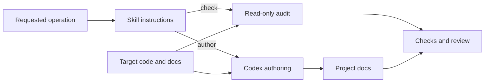

# Architecture

<a href="#english">English</a> · <a href="#korean">한국어</a>

## English

The skill routes the user's request to focused authoring guidance. Codex reads
the actual code and writes project-specific documentation. The independent
auditor reads files and Git metadata; it never executes detected project scripts.

| Component | Source |
|---|---|
| Workflow router | [SKILL.md](../skills/project-init/SKILL.md) |
| Authoring guidance | [initialize.md](../skills/project-init/references/initialize.md) |
| Audit CLI and report | [project_audit.py](../skills/project-init/scripts/project_audit.py) |
| Bounded filesystem access | [filesystem.py](../skills/project-init/scripts/project_init_audit/filesystem.py) |
| Document roles and links | [documents.py](../skills/project-init/scripts/project_init_audit/documents.py) |
| Project facts and command provenance | [project.py](../skills/project-init/scripts/project_init_audit/project.py) |
| Scoped Git observations | [git.py](../skills/project-init/scripts/project_init_audit/git.py) |
| Installer | [install.py](../scripts/install.py) |
| Shared payload and source validation | [distribution.py](../scripts/distribution.py) |
| Reproducible ZIP builder | [package_plugin.py](../scripts/package_plugin.py) |
| Distribution verification | [validate_distribution.py](../scripts/validate_distribution.py) |

Document checks use the working tree; commit preflight reads index blobs and
scoped diffs. The report separates command declarations from conventional
suggestions and records incomplete coverage. See the [auditor contract](reference/auditor.md).

The installer and packager share the same validated payload. Installation first
prepares a complete candidate and helper-generated marketplace state, then
replaces the destination with recovery information. Packaging fixes ZIP metadata
and validates archive contents and checksums. Both distributions contain the
complete skill; the plugin archive also carries the source project's operating
docs and tooling. See the [release runbook](runbooks/release.md).

## 한국어

스킬은 사용자 요청에 맞는 작성 지침을 선택합니다. Codex가 실제 코드를 읽고
프로젝트별 문서를 작성합니다. 독립된 검사 도구는 파일과 Git 메타데이터를 읽으며,
탐지한 프로젝트 명령을 실행하지 않습니다.

| 구성 요소 | 소스 |
|---|---|
| 작업 분기 | [SKILL.md](../skills/project-init/SKILL.md) |
| 작성 지침 | [initialize.md](../skills/project-init/references/initialize.md) |
| 검사 CLI와 결과 | [project_audit.py](../skills/project-init/scripts/project_audit.py) |
| 범위가 제한된 파일 접근 | [filesystem.py](../skills/project-init/scripts/project_init_audit/filesystem.py) |
| 문서 역할과 링크 | [documents.py](../skills/project-init/scripts/project_init_audit/documents.py) |
| 프로젝트 정보와 명령 출처 | [project.py](../skills/project-init/scripts/project_init_audit/project.py) |
| 지정 범위의 Git 조사 | [git.py](../skills/project-init/scripts/project_init_audit/git.py) |
| 설치 도구 | [install.py](../scripts/install.py) |
| 공통 배포 대상과 소스 검증 | [distribution.py](../scripts/distribution.py) |
| 재현 가능한 ZIP 생성 | [package_plugin.py](../scripts/package_plugin.py) |
| 배포 파일 검증 | [validate_distribution.py](../scripts/validate_distribution.py) |

문서 검사는 작업 트리를 기준으로 하며, 커밋 사전 검사는 인덱스 blob과 지정
범위의 diff를 읽습니다. 결과에서 실제 명령 선언과 관례적 제안을 구분하고
불완전한 검사 범위를 기록합니다. [검사 도구 계약](reference/auditor.md)을
참고하세요.

설치 도구와 패키징 도구는 같은 검증된 배포 대상을 사용합니다. 설치는 완전한
후보 소스와 도우미가 생성한 마켓플레이스 상태를 먼저 준비한 뒤, 복구 정보를
갖추고 설치 대상을 교체합니다. 패키징은 ZIP 메타데이터를 고정하고 압축 내용과
체크섬을 검증합니다. 두 배포 형식 모두 전체 스킬을 포함하며 플러그인 ZIP에는
소스 프로젝트의 운영 문서와 도구도 들어 있습니다.
[릴리스 런북](runbooks/release.md)을 참고하세요.
